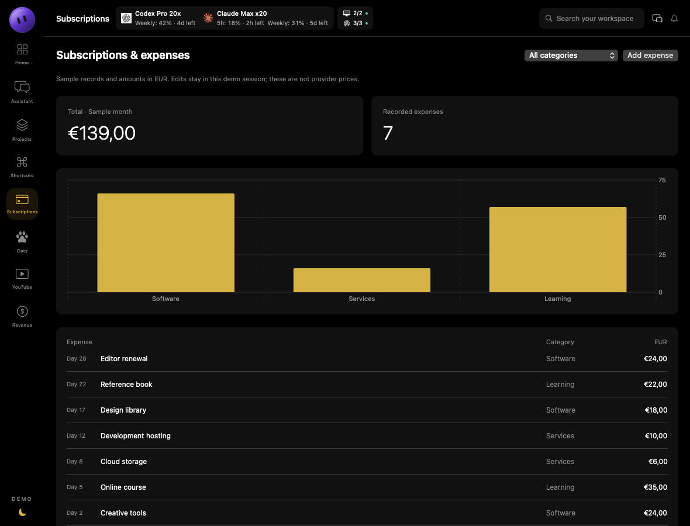

# Jarvis for macOS

**A personal workspace dashboard built with Swift and SwiftUI.**

Jarvis is my native macOS workspace app. It combines a compact dashboard with a floating quota bar that stays within reach while I work in other apps.

This repository is a **public portfolio edition**: a runnable offline demo, selected source from the personal application, and engineering notes. The screenshots show the public edition with fictional data. They do not show live account readings.

## Floating widget


The floating bar is a real AppKit panel, with the same arrangement as the personal app:

- Codex weekly usage and Claude session/weekly usage.
- Clickable quota and machine/connection details.
- A quick-access grid for channel shortcuts.
- A drag handle, hide button and button to return to Jarvis.
- Floating window level and support for other Spaces and full-screen apps.

Start the demo, then choose **Widget → Show floating widget** from the menu bar, or click the small picture-in-picture button in the dashboard header. Drag the dotted handle to move it. The close button hides it; the menu restores it. Position is session-local in this edition.

Readings and shortcut destinations are fictional. The controls work locally; no provider, server, browser profile or personal account is accessed.


## Workspace

The demo now follows the personal app's compact layout: narrow navigation rail, quota strip in the header, Mission Controls, quick access, recent work, checklist and pinned actions.


## Try it

Requires **macOS 13 or later** and **Swift 5.9 or later**, available through Xcode or the Xcode Command Line Tools. The package has no third-party dependencies.

```sh
git clone https://github.com/aliradid/jarvis-macos.git
cd jarvis-macos
swift run JarvisDemo
```

- **Overview:** add and complete checklist items, pin sample actions, and preview workspace shortcuts.
- **Shortcuts:** search, select and rename example shortcuts. Selection previews a launch plan; it does not open a browser or execute a command.
- **Assistant:** edit a Darija phrase and see local Latin-script transliteration. Connected chat is excluded.
- **Floating widget:** open popovers, preview channel shortcuts, drag, hide and restore the panel.
- **Expenses:** filter categories and add sample expenses; totals and the chart update immediately.
- **YouTube and Revenue:** switch between fictional channels and 7/30-day periods. Views, revenue and RPM are computed from the generated daily records.
- **Pet expenses:** explore a separate sample spending ledger without pet names or personal records.

Demo edits remain in memory and reset when the app closes. No account setup is needed.

## Expenses and analytics

The spending and analytics features remain in the demo with entirely synthetic records. No real channel names, account identifiers, bills or financial figures are included.




## What is included

| Component | Origin | What you can inspect |
| --- | --- | --- |
| Shortcut and workspace model | Extracted from Jarvis; example ports normalized | Stable tile identity, search, grouping, overrides, URL validation and launch planning |
| Configuration storage | Extracted from Jarvis; default directory isolated for this edition | Atomic writes, backups, corruption recovery and duplicate-ID validation |
| Darija transliteration | Extracted from Jarvis; one domain-specific dictionary entry omitted | Local dictionary handling, diacritics and a system transliteration fallback |
| SwiftUI workspace | Adapted to follow the personal app layout | Compact navigation, checklist, pins and shortcuts |
| Floating widget | Adapted from the personal app panel and status strip | Floating NSPanel, drag handle, popovers, quick access and window controls |
| Avatar | Extracted from the personal app | Original vector avatar |
| Regression tests | Written for this edition | Recovery failures, preserved backups, rejected URLs and model behavior |

The personal application also contains account integrations and operational workflows. Those adapters and their configuration are outside this repository. The public dashboard's quota, health and project cards are **fixtures**, not implemented integrations.

## Engineering decisions

### Protect recoverable data

A failed settings decode must not silently replace a user's setup with defaults. The storage component preserves unreadable bytes, attempts recovery from a validated backup, and returns a `canSave` flag when editing must be blocked. Callers are responsible for honoring that flag.

### Separate intent from execution

The model builds a typed launch plan independently from opening a file or URL. That makes routing testable without launching applications. The public edition includes planning only.

### Keep identity stable

Changing a shortcut label or reconnecting a file should preserve its group membership, workspace references and artwork. Model operations update those properties without replacing the tile's identity.

### Be explicit about unavailable information

The demo distinguishes an unavailable reading from a numeric zero. Its sample status cards illustrate this presentation decision without querying a provider.

Read the [architecture notes](docs/ARCHITECTURE.md) and [publication boundaries](docs/PUBLICATION.md).

## Screens

### Shortcuts


### Local language support


Transliteration changes the writing system, not the meaning. The small dictionary is not a language model; unfamiliar words and names may require correction.

## Verify

```sh
bash scripts/test-core.sh
python3 scripts/check_publication.py
```

The tests use unique temporary directories for storage scenarios. To regenerate the workspace and widget images from the SwiftUI views:

```sh
swift run JarvisDemo --render docs/images
```

## About this repository

Jarvis is my personal workspace app. This repository contains an offline demo and selected components from the app. Account integrations and personal configuration remain private.

This is not the complete personal app, a production distribution, or a notarized macOS release. No open-source license is granted in this edition.
