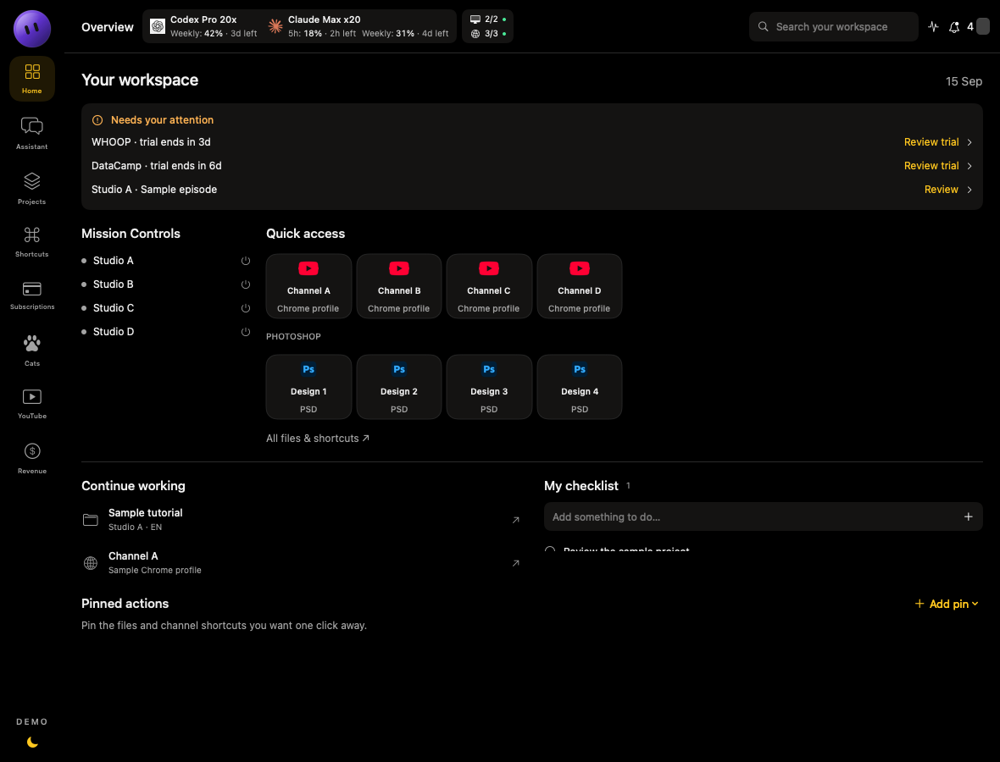
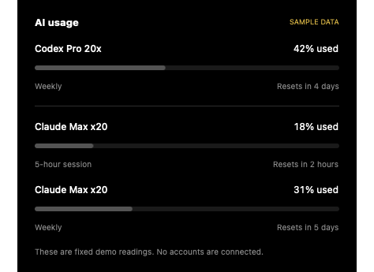
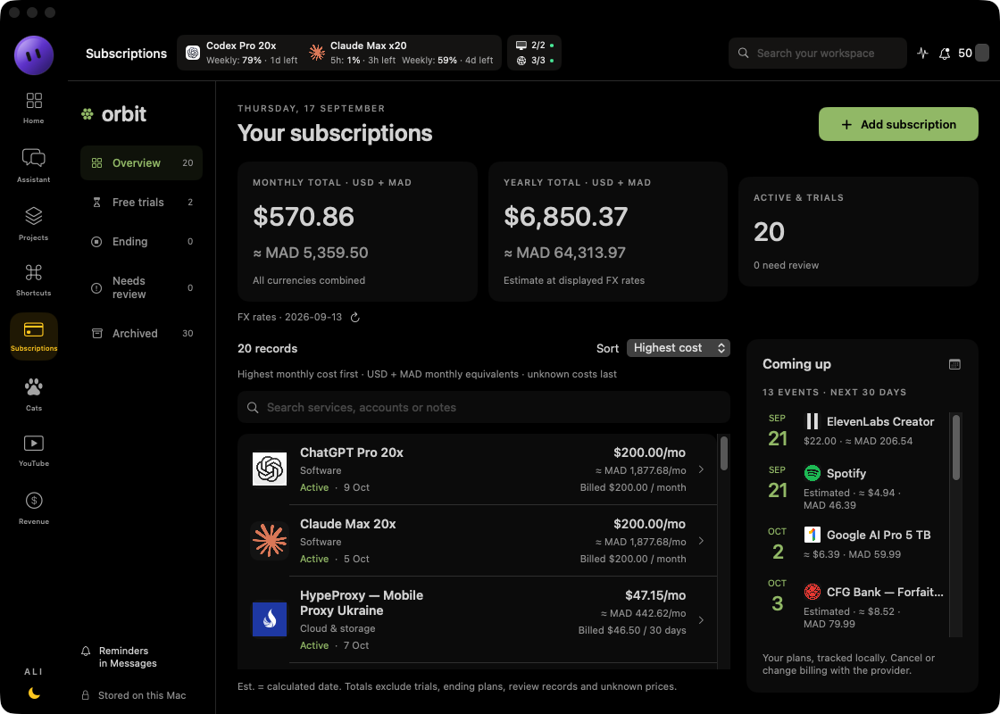
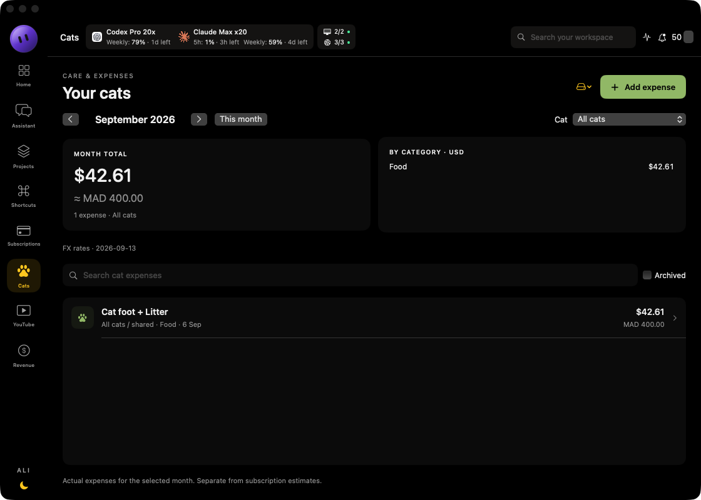
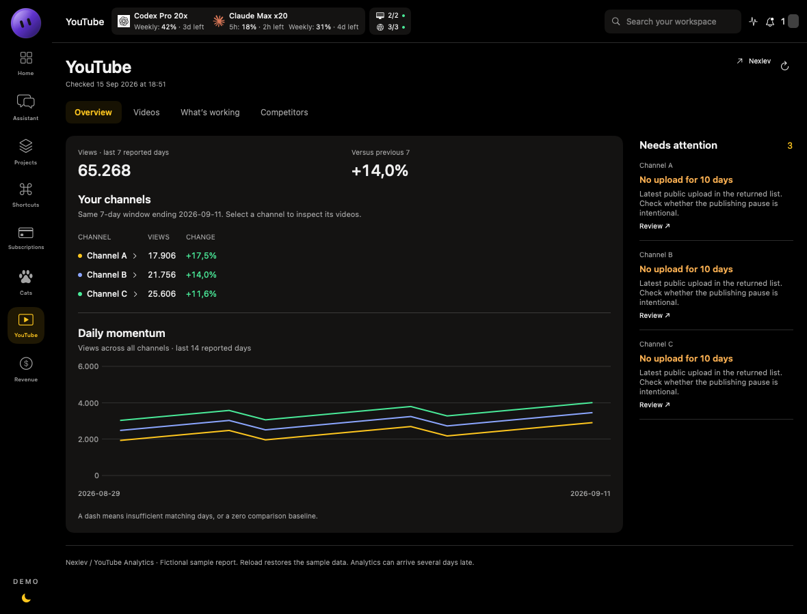
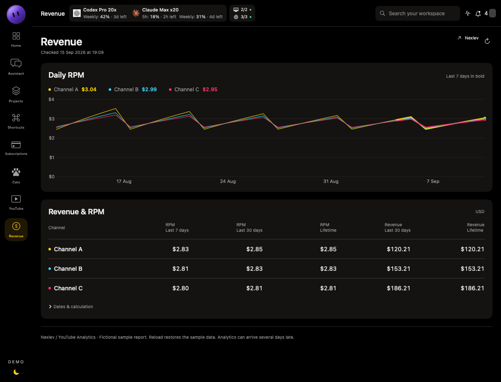
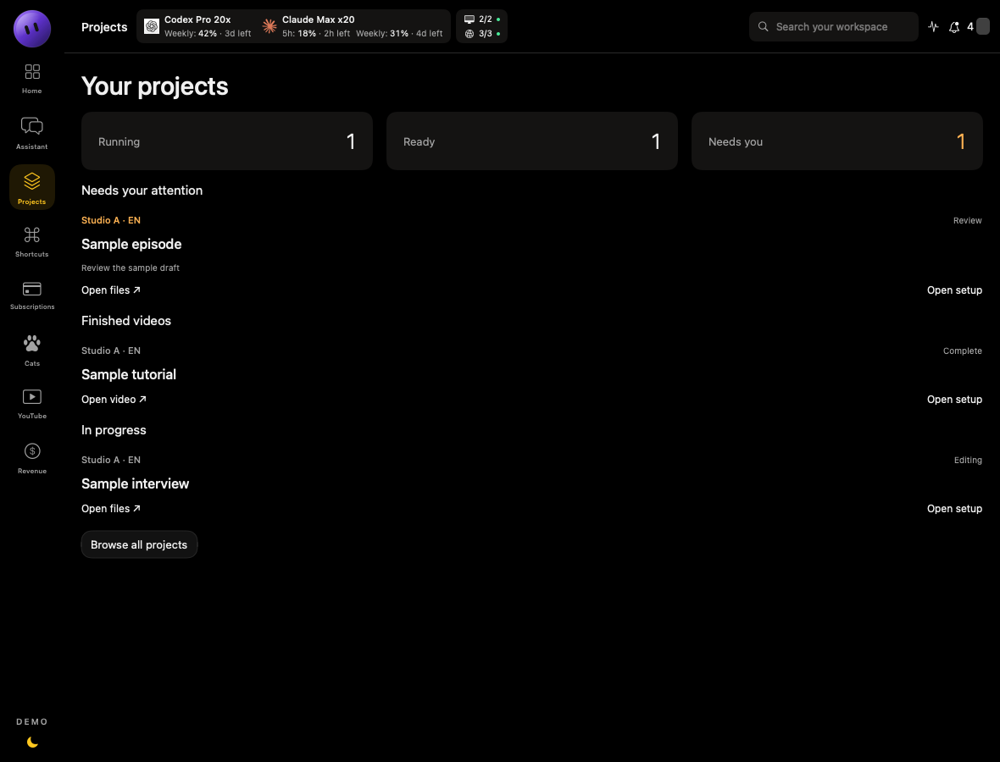
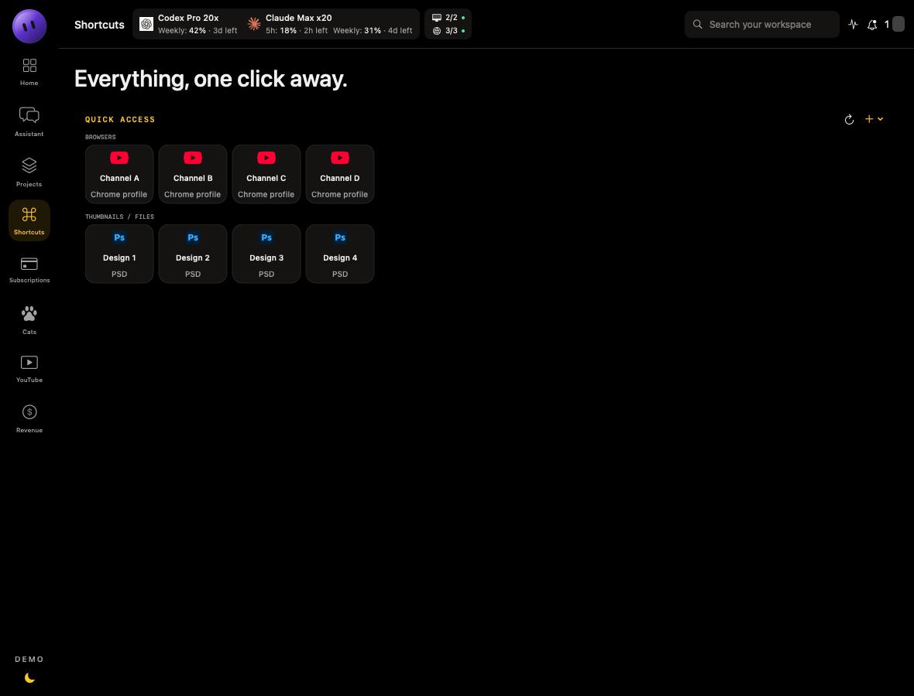
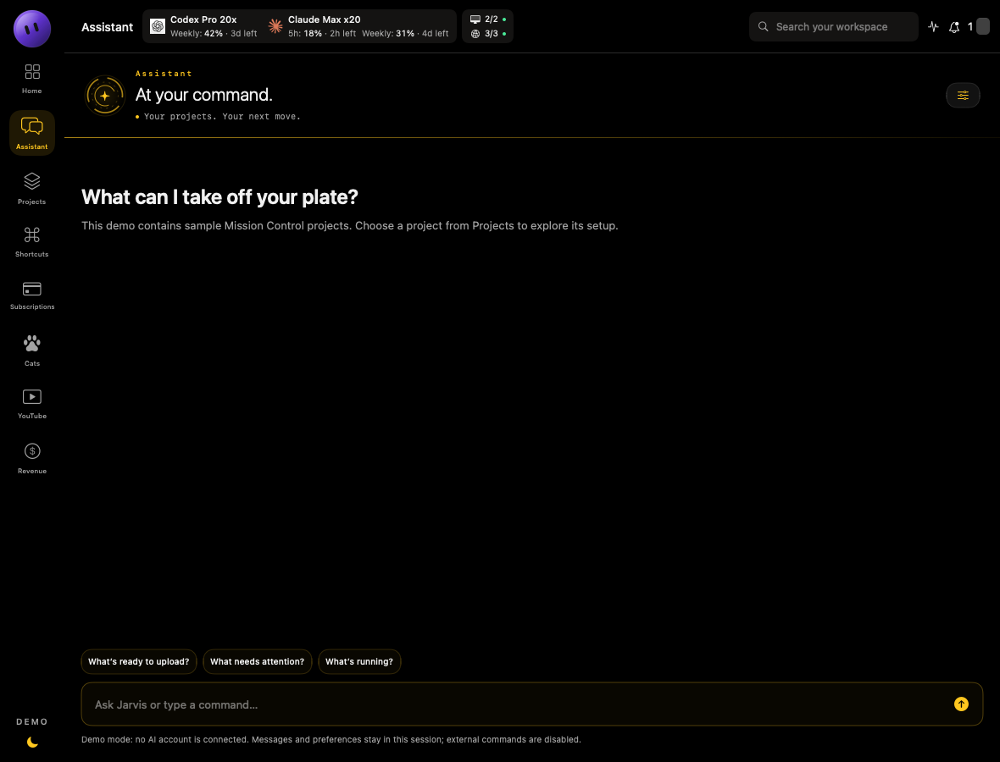

# Jarvis for macOS

**My native macOS workspace app, built with SwiftUI and AppKit.**

Jarvis brings projects, shortcuts, subscriptions, cat expenses, YouTube analytics and account-usage indicators into one workspace. A floating widget keeps quotas and channel shortcuts within reach while using other apps.

This public edition uses the application's original views. The **subscriptions and cat expenses screenshots below are captures of my running personal app**, so their records, amounts, dates and totals are real. Every other screenshot, and the demo you can build from this repository, uses fictional data: subscription **provider and plan names** come from my actual list, with account labels, stores, domains and other identifying additions removed, while amounts, dates, cycles and statuses are invented. Channel names, projects, financial figures, machine details and account readings are also samples. Private integrations are disconnected; sample subscription amounts are not provider prices.

## Workspace



The original home includes Mission Controls, quick access, Photoshop shortcuts, recent work, a checklist, pinned actions and items needing attention.

## Floating widget


Choose **Widget → Show floating widget** from the app's menu bar. Drag the dotted handle to move it, click the quota or connection indicators for details, or open the channel shortcut grid. The close button hides the panel; the menu restores it. The arrow returns to the main window.

The widget uses the same quota strip and detail views as the dashboard. Its readings are fictional; it does not inspect signed-in accounts or probe machines.



## Subscriptions



The original Orbit interface includes monthly and yearly USD/MAD totals, billing-cycle conversion, a renewal timeline, trials, ending plans, records needing review, search, sorting and archiving. The subscription editor retains price and date certainty, reminder settings, notes and source fields. Unknown costs and missing exchange rates are disclosed rather than counted as zero.

## Expenses and analytics



Cat expenses retain the original monthly view, category totals, search, filters, editing, archiving and import/export controls.





YouTube includes the original Overview, Videos, What’s working and Competitors views. Revenue uses the original daily RPM chart and financial comparison table. Sample daily records feed the existing calculations; thumbnails use the existing empty-image presentation.

## Projects, shortcuts and assistant







Project browsing and setup previews, shortcut editing, messages, diagnostics, and the assistant interface come from the personal app. The assistant does not generate replies in this edition. External project launching and server startup report that they are disabled.

## Run

Requires macOS 13 or later and Swift 5.9 or later. No third-party package dependencies are required.

```sh
git clone https://github.com/aliradid/jarvis-macos.git
cd jarvis-macos
swift run JarvisDemo
```

Demo records and preferences reset with the app. Explicit file import/export and artwork selection use native file pickers. Public provider links open only when clicked. No account setup is needed.

## Checks

```sh
python3 scripts/check_publication.py
swift build
bash scripts/test-core.sh
swift run JarvisDemo --check
```

The checks cover configuration recovery, URL validation, fixture decoding, subscription totals and edits, unknown costs, missing FX, cat archiving, analytics windows and session isolation. Screenshots are rendered from the demo views with `JarvisDemo --render OUTPUT_DIRECTORY`, except the subscriptions and cat expenses images, which are window captures of the personal app.

See [architecture](docs/ARCHITECTURE.md), [source fidelity](docs/SOURCE_FIDELITY.md), [publication boundaries](docs/PUBLICATION.md) and [security](SECURITY.md).

This repository is a portfolio edition, not the complete personal app or a notarized release. No open-source license is granted in this edition. Brand artwork identifies the relevant services; it does not imply endorsement.
