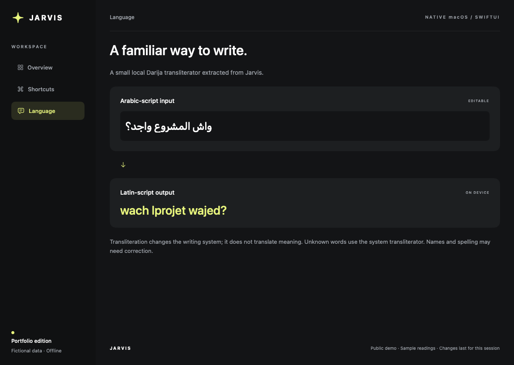

# Jarvis for macOS

**A personal workspace dashboard built with Swift and SwiftUI.**

Jarvis brings shortcuts, project context and service status into a single native interface. I built it to reduce the repeated switching between tools in my daily workflow.

This repository is a **public portfolio edition**: a runnable offline demo, selected source from the personal application, and engineering notes. The screenshots show the public edition with fictional data. They do not show live account readings.


## Try it

Requires **macOS 13 or later** and **Swift 5.9 or later**, available through Xcode or the Xcode Command Line Tools. The package has no third-party dependencies.

```sh
git clone https://github.com/aliradid/jarvis-macos.git
cd jarvis-macos
swift run JarvisDemo
```

- **Overview:** explore the dashboard composition using fixed sample readings.
- **Shortcuts:** search, select and rename example shortcuts. Selection previews a launch plan; it does not open a browser or execute a command.
- **Language:** edit an Arabic-script Darija phrase and see local Latin-script transliteration.

Demo edits remain in memory and reset when the app closes. No account setup is needed.

## What is included

| Component | Origin | What you can inspect |
| --- | --- | --- |
| Shortcut and workspace model | Extracted from Jarvis; example ports normalized | Stable tile identity, search, grouping, overrides, URL validation and launch planning |
| Configuration storage | Extracted from Jarvis; default directory isolated for this edition | Atomic writes, backups, corruption recovery and duplicate-ID validation |
| Darija transliteration | Extracted from Jarvis; one domain-specific dictionary entry omitted | Local dictionary handling, diacritics and a system transliteration fallback |
| SwiftUI demo | Built for this public edition | Dashboard layout and interactive use of the extracted model |
| Regression tests | Written for this edition | Recovery failures, preserved backups, rejected URLs and model behavior |

The personal application also contains account integrations and operational workflows. Those adapters and their configuration are outside this repository. The public dashboard's quota, health and project cards are **fixtures**, not implemented integrations.

## Engineering decisions

### Protect recoverable data

A failed settings decode must not silently replace a user's setup with defaults. The storage component preserves unreadable bytes, attempts recovery from a validated backup, and returns a `canSave` flag when editing must be blocked. Callers are responsible for honoring that flag.

### Separate intent from execution

The model builds a typed launch plan independently from opening a file or URL. That makes routing testable without launching applications. The public edition includes planning only.

### Keep identity stable

Changing a shortcut label or reconnecting a file should preserve its group membership, workspace references and artwork. Model operations update those properties without replacing the tile's identity.

### Be explicit about unavailable information

The demo distinguishes an unavailable reading from a numeric zero. Its sample status cards illustrate this presentation decision without querying a provider.

Read the [architecture notes](docs/ARCHITECTURE.md) and [publication boundaries](docs/PUBLICATION.md).

## Screens

### Shortcuts


### Local language support



Transliteration changes the writing system, not the meaning. The small dictionary is not a language model; unfamiliar words and names may require correction.

## Verify

```sh
bash scripts/test-core.sh
python3 scripts/check_publication.py
```

The tests use unique temporary directories for storage scenarios. To regenerate the three demo images from the SwiftUI views:

```sh
swift run JarvisDemo --render docs/images
```

## About this repository

Jarvis is my personal workspace app. This repository contains an offline demo and selected components from the app. Account integrations and personal configuration remain private.

This is not the complete personal app, a production distribution, or a notarized macOS release. No open-source license is granted in this edition.
