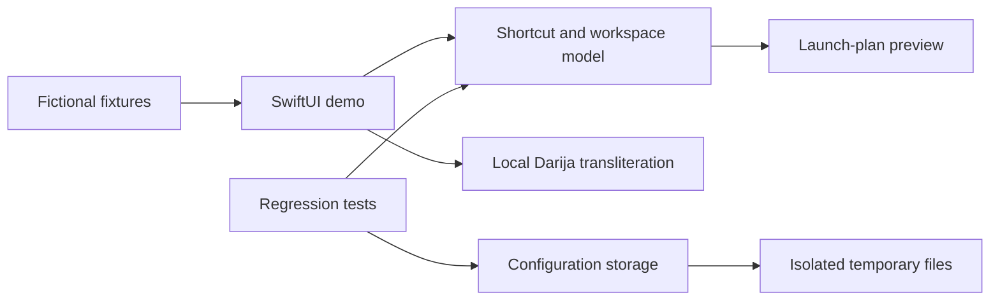

# Architecture

## Public edition

The UI has no network client, shell runner, browser-profile discovery or live provider adapter. Its edits are session-local. The storage component is exercised by tests independently of the UI.

## File map

- `Sources/JarvisDemo/DemoApp.swift`: navigation, dashboard, shortcut editing and image rendering.
- `Sources/JarvisDemo/DemoFixtures.swift`: explicitly fictional shortcut data.
- `Sources/JarvisDemo/Model.swift`: configuration types and pure operations for tiles, groups, links and workspaces.
- `Sources/JarvisDemo/Storage.swift`: JSON validation, atomic persistence, backup recovery and artwork storage helpers.
- `Sources/JarvisDemo/DarijaLatin.swift`: local transliteration dictionary and Unicode fallback.
- `Tests/JarvisDemoTests/CoreTests.swift`: behavioral regression checks.

## Persistence contract

1. Decode and validate a configuration before accepting it.
2. Before replacing an existing valid configuration, write its bytes to a backup.
3. Write the replacement atomically.
4. On a read failure, preserve the damaged file before trying the backup.
5. If recovery is impossible, return an explicit non-saveable state.

This is a recovery mechanism, not encryption or a transactional database. Backup and primary-file writes are separate operations. `saveConfig` does not enforce a previously returned `canSave` flag; UI callers must do so. Paths passed to storage helpers must be trusted by their caller. The UI demo does not accept filesystem paths or expose artwork helpers.

## Identity and URL handling

Tile IDs allow display names to change without breaking references. The model uses a truncated SHA-1 digest for deterministic file/link identifiers. That hash is an identity convenience, not a password hash, integrity guarantee or security boundary.

Link editing accepts HTTP/HTTPS URLs and rejects embedded credentials. This validates input shape; it does not establish that a destination is trustworthy. The public demo only previews fixed example destinations and does not visit them.

## Tests and limits

Tests cover corruption with and without a valid backup, preserving a good backup, rejecting duplicate IDs and malformed fields, legacy decoding, URL validation, rename/search behavior, missing workspace members and transliteration.

They do not establish the reliability of excluded integrations, concurrent file writers or the full personal application. Rendered screenshots verify the public view composition; they are not proof of live provider functionality.
